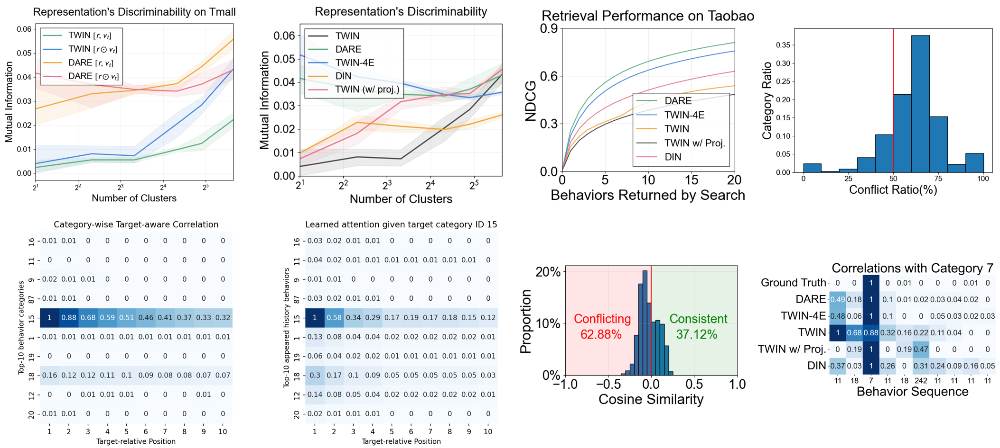

# Long-Sequence Recommendation Models Need Decoupled Embeddings

This repository provides the official implementation of **DARE: Decoupled Attention and Representation Embedding model**.

## 🔥 News

Our paper has been accepted to **International Conference on Learning Representations** (ICLR 2025).

## 🛠️ Environment

There are no strict package version requirements. You can use your existing environment with PyTorch support and install additional dependencies as needed. If you prefer, you can also set up a new Conda environment using the following commands:

```
conda create --name DARE python=3.7
conda activate DARE
pip install -r requirements.txt
```

## 📦 Dataset

Our experiments use the Taobao and Tmall datasets. To download and preprocess the data, follow the instructions in [preprocess/README.md](./preprocess/README.md).

## 🚀 Train

We support training **DARE**, **TWIN**, **DIN**, and their variants on the Taobao and Tmall datasets.
Example training scripts can be found in: [scripts/Taobao.sh](./scripts/taobao.sh) and [scripts/tmall.sh](./scripts/tmall.sh) (Explanations of input parameters can be found in [train_pytorch.py](train_pytorch.py)).

For **ETA, SDIM, and TWIN-V2**, the code is not yet open-source. If you need their implementations, please contact the respective authors.

Note that there are **various simple tricks** that may affect the results. Adding or removing them could slightly change performance.
Besides, candidate sampling introduces randomness, leading to slight variations in absolute results. However, the relative performance trends should remain consistent with our paper.

## 🎇 Analysis

The analysis scripts are located in the [./analysis](./analysis) directory, covering [attention](./analysis/attention_accuracy_analysis),
[gradient](./analysis/gradient_domination_and_conflict_analysis), [representation](./analysis/gradient_domination_and_conflict_analysis)
and [training](./analysis/performance_during_training_analysis). Each folder contains a README.md with instructions. Running the provided commands will generate figures like the following:




## 📜 Citation

If you find this project useful, please cite our paper:

```
@inproceedings{feng2025DARE,
    title={Long-Sequence Recommendation Models Need Decoupled Embeddings}, 
    author={Ningya Feng and Junwei Pan and Jialong Wu and Baixu Chen and Ximei Wang and Qian Li and Xian Hu and Jie Jiang and Mingsheng Long},
    booktitle={International Conference on Learning Representations},
    year={2025},
}
```

## 🤝 Contact

If you have any question, please contact fny21@mails.tsinghua.edu.cn

## 💡 Acknowledgement

Our code is based on [SIM Official Code](https://github.com/tttwwy/sim) and [UBR4CTR](https://github.com/qinjr/UBR4CTR).

