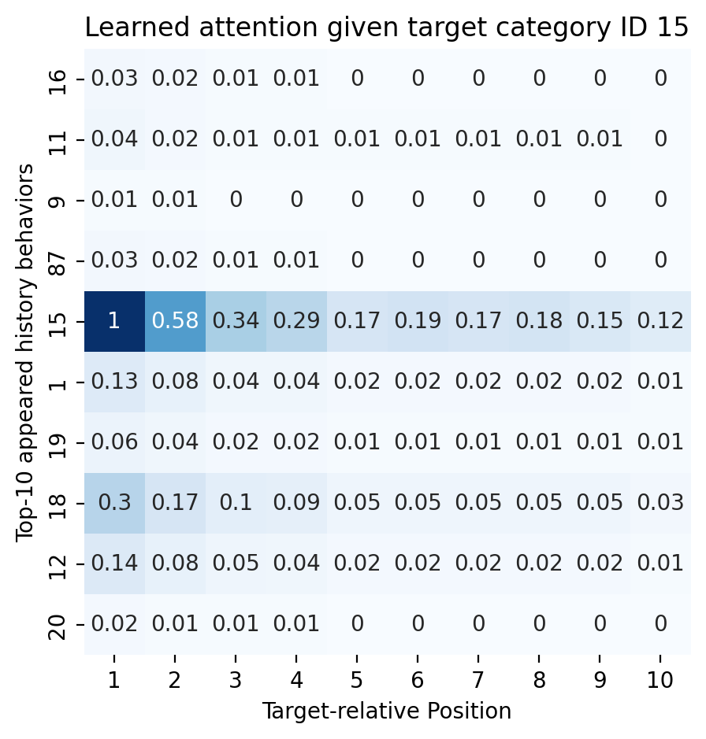
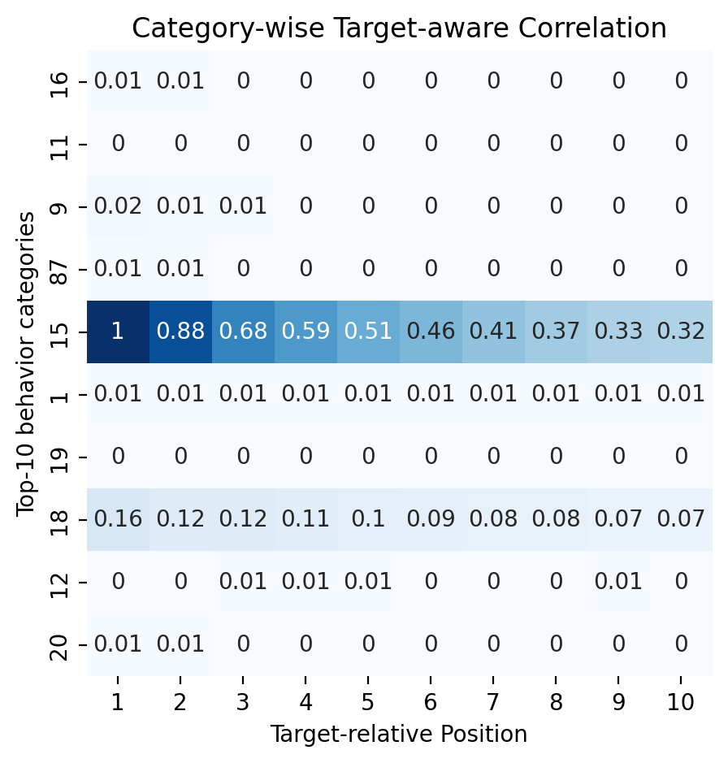
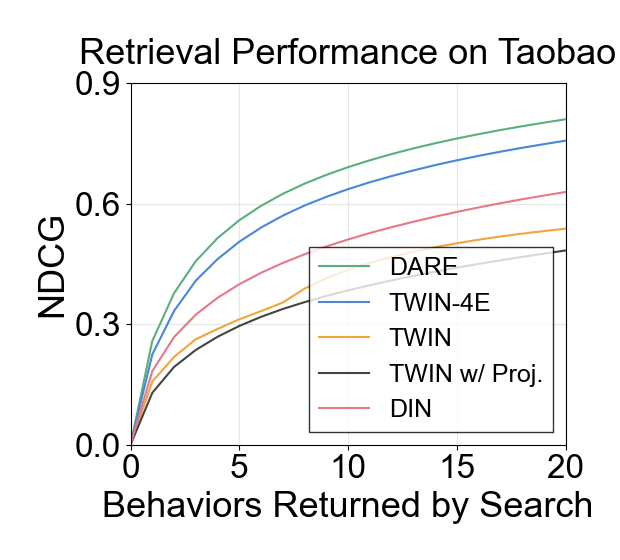
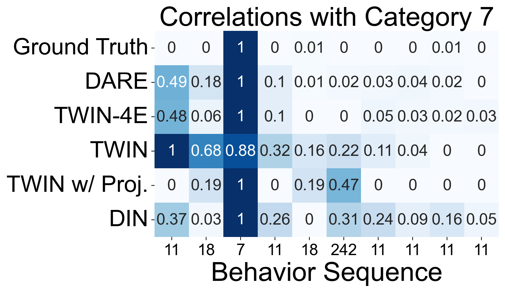

# The analysis of attention accuracy

Note that if certain files cannot be found, you may need to manually add the paths in your script using:
```
import sys
sys.path.append("file_absolute_path")
```

This document provides instructions on how to replicate our "Attention Accuracy" analysis from Section 4.3 of our paper.

## Comparing learned attention and mutual information

Run the command in [./script/mi_vs_learned.sh](./script/mi_vs_learned.sh) and you will get figures like that:

<div style="float: left; width: 99%">


</div>

## Evaluating retrieval performance on the test dataset

Run the command in [./script/gsu_performance.sh](./script/gsu_performance.sh) to analyze the retrieval performance. Then run the following command for visualization:

```
python gsu_performance_draw.py
```

This will generate a figure like:



## Case study of retrieval

``gsu_performance_draw.py``  records the learned correlation scores for each test sample. To perform a case study, you can run the following command:

```
python case_study.py
```

This will generate figures like:




