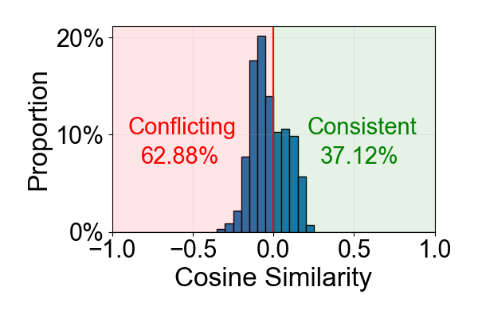
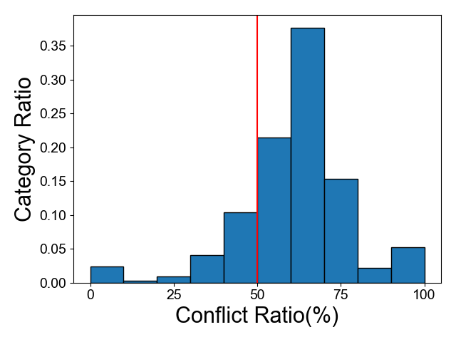

# The analysis of gradient domination and gradient conflict

You only need to set the parameter "stor_grad=True" and "observe_attn_repr_grad=True" to collect the gradient during training. 
Its working principle is explained later in this README.md

For example, collect the gradient of TWIN on Taobao Dataset:
```
python train_pytorch.py -train_dataset_path 'data/taobao/train_{}_{}.npy' -val_dataset_path 'data/taobao/val.npy' -test_dataset_path 'data/taobao/test.npy' -max_length 200 -item_n 4068791 -cate_n 9408 -long_seq_split '0:200' -short_model_type DIN -long_model_type DIN -use_cross_feature True -attn_func scaled_dot_product -hard_or_soft soft -top_k 20 -use_aux_loss True -use_time_mode concat -time_embedding_dim 16 -epoch 2 -category_embedding_dim 16 -batch_size 2048 -learning_rate 0.01 -weight_decay 0.000001 -seed 1 -log_dir log/taobao/model_twin_stor_grad -test_interval 150 -log_interval 50 -model_name twin -stor_grad -observe_attn_repr_grad
```

Then you can observe the gradient conflict, category-grouped gradient conflict, and gradient domination with the following command:
```
python gradient_conflict.py
python category_wise_gradient_conflict.py
python gradient_domination.py
```

You will get pictures like that:

<div style="float: left; width: 99%">


</div>

Note that **the gradients may vary a lot during the training process**.
You can change our code and analysis the gradients of different training period as you like.
The result could be quite interesting.

## Working principle
To analyze the gradients in TWIN, we adopted a method similar to our DARE model by utilizing two embedding tables: one for attention and another for representation. This allowed the gradients from attention and representation to be back-propagated separately to their respective embeddings.

To ensure the model operated exactly the same as TWIN, we initialized the two embedding tables with identical parameters. 
During each iteration, we manually updated the gradients such that 
$grad_{attn}$ and $grad_{repr}$ were both set to the sum of the two gradients, 
i.e. $grad_{attn} \leftarrow grad_{attn} + grad_{repr}, grad_{repr} \leftarrow grad_{attn} + grad_{repr}$, 
. Throughout the training process, we carefully maintained the synchronization of the two embeddings, ensuring that their parameters keeps the same.

This approach guarantees that the model’s performance and behavior are identical to the original TWIN model under the same seed, while enabling us to observe the gradients from attention and representation separately for the two embedding tables.

The process can be summarized as follows:

- Use two embedding tables, similar to DARE.

- Initialize the two embedding tables with identical parameters.

- Manually update the gradients during each iteration.

- Back-propagate the gradients from attention and representation to the respective embedding tables for observation.

- Confirm that this method reproduces the original TWIN model exactly.
