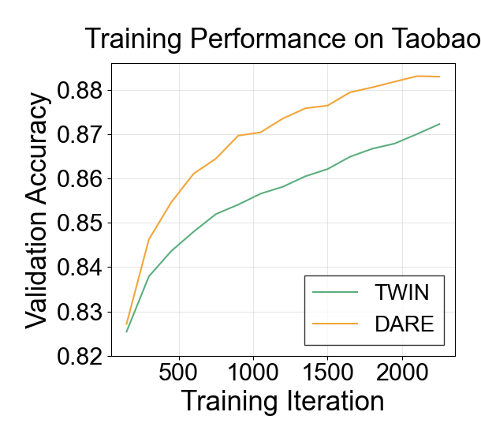

This is just a simple visualization of the model's performance during training.

By running the following command, you can get figures like that:



```
python performance_during_training.py --twin_record_path ../../log/taobao/model_twin/performance_during_training/record.txt --dare_record_path ../../log/taobao/model_DARE/performance_during_training/record.txt --output_path ./taobao_performance_during_training_result
python performance_during_training.py --twin_record_path ../../log/tmall/model_twin/performance_during_training/record.txt --dare_record_path ../../log/tmall/model_DARE/performance_during_training/record.txt --output_path ./tmall_performance_during_training_result
```
