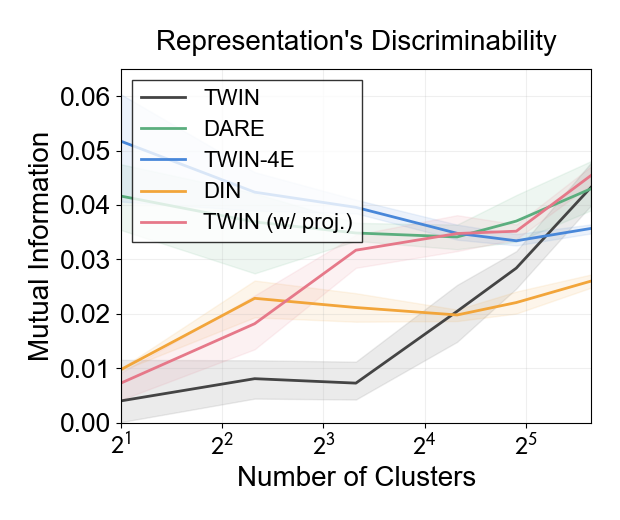
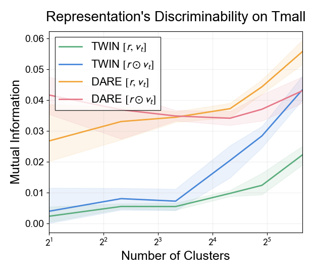

This code analyzes the discriminability of representation. You can refer to Section 4.4 in our paper for detail information.

Install dependencies
```
pip install scikit-learn
pip install rliable
```

First, you can run the DARE without Target Representation (TR) model for TR analysis. Use the following command:

Taobao
```
# DARE no TR
python train_pytorch.py -train_dataset_path 'data/taobao/train_{}_{}.npy' -val_dataset_path 'data/taobao/val.npy' -test_dataset_path 'data/taobao/test.npy' -max_length 200 -item_n 4068791 -cate_n 9408 -long_seq_split '0:200' -short_model_type DIN -long_model_type DIN -attn_func scaled_dot_product -hard_or_soft soft -top_k 20 -use_aux_loss True -use_time_mode concat -time_embedding_dim 16 -epoch 2 -category_embedding_dim 16 -batch_size 2048 -learning_rate 0.01 -weight_decay 0.000001 -seed 1 -log_dir log/taobao/model_DARE_no_TR -test_interval 150 -log_interval 50 -model_name DARE
```

Tmall
```
# DARE no TR
python train_pytorch.py -train_dataset_path 'data/tmall/train_{}_{}.npy' -val_dataset_path 'data/tmall/val.npy' -test_dataset_path 'data/tmall/test.npy' -max_length 200 -item_n 1080667 -cate_n 1493 -long_seq_split '0:200' -short_model_type DIN -long_model_type DIN -attn_func scaled_dot_product -hard_or_soft soft -top_k 20 -use_aux_loss True -use_time_mode concat -time_embedding_dim 16 -epoch 2 -category_embedding_dim 16 -batch_size 2048 -learning_rate 0.01 -weight_decay 0.000001 -seed 1 -log_dir log/tmall/model_DARE_no_TR -test_interval 150 -log_interval 50 -model_name DARE
```

Then, you can collect the representations of models and gather them by K-means by running the command in [scripts/taobao.sh](scripts/taobao.sh) and [scripts/tmall.sh](scripts/tmall.sh). It may take quite a while (several hours).

Finally, for visualization, run the command in [scripts/visualize.sh](scripts/visualize.sh). You will get figures like that:

<div style="float: left; width: 99%">


</div>
